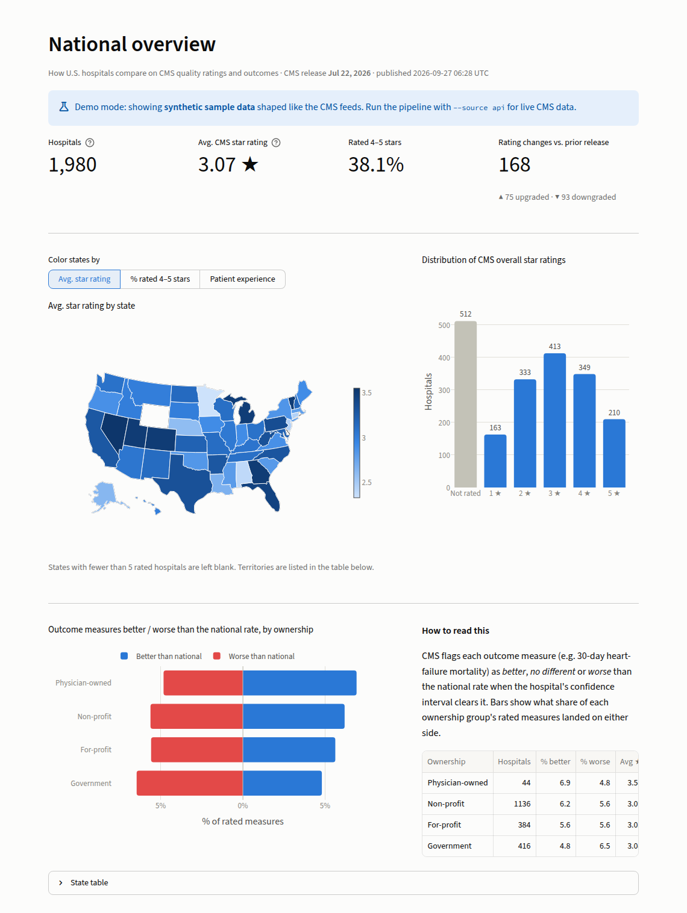
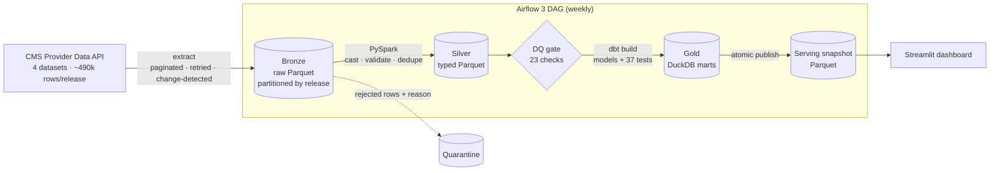
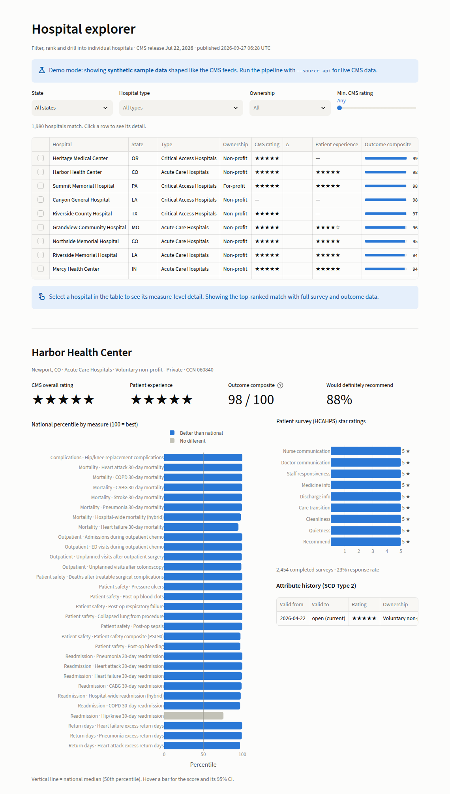
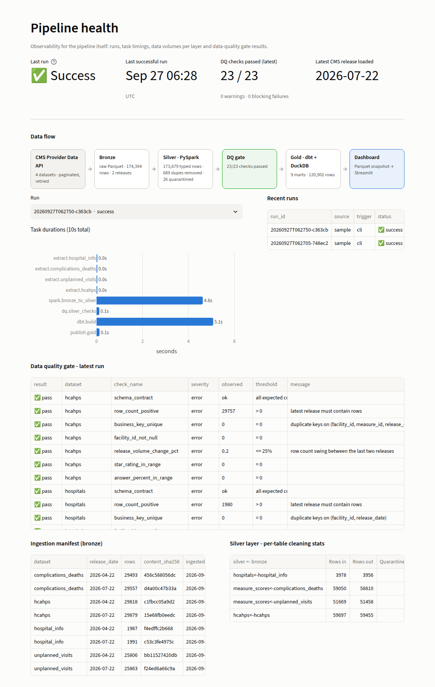

# CMS Hospital Quality Lakehouse

An end-to-end data engineering pipeline built on public **CMS Care Compare** data. It covers every U.S. Medicare-certified hospital's star rating, 30+ outcome measures (mortality, complications, readmissions) and the HCAHPS patient survey. The data moves from a paginated REST API through a medallion lakehouse (**bronze → PySpark silver → dbt/DuckDB gold**). It is orchestrated by **Airflow 3**, guarded by two layers of **data-quality checks**, tested in **CI**, and served to a **Streamlit dashboard** that includes a pipeline-observability page.

<!-- After pushing, replace YOUR_GITHUB_USER to enable the badge -->
<!--  -->



## Architecture



| Layer | Tech | What happens |
|---|---|---|
| **Extract** | `requests` + `tenacity` | Offset pagination over the DKAN datastore API with exponential-backoff retries on 429/5xx. The dataset's `modified` date is checked first, so an unchanged CMS release is skipped (idempotent). |
| **Bronze** | PyArrow → Parquet | Every column lands as a raw string, plus audit columns (`_run_id`, `_ingested_at`, `_release_date`). One immutable partition per CMS release is written atomically (tmp dir → rename), with a manifest and a content SHA-256. |
| **Silver** | **PySpark 4** | CMS sentinels (`"Not Available"`, `"--"`) become NULL. Values are cast with ANSI-safe `try_cast` / `try_to_timestamp`. Rows that break key rules (bad CCN, unknown state) go to **quarantine** with a reason, and duplicates are removed on the business key. The two measure feeds are conformed into one table. Processing is **incremental**: only new release partitions are read, with dynamic partition overwrite. |
| **DQ gate** | DuckDB SQL | 23 declarative checks: schema contract, key uniqueness, ranges, release-over-release volume swing, orphan rate, quarantine rate and freshness. `error` checks stop the run; `warn` checks are recorded. |
| **Gold** | **dbt + DuckDB** | Staging → intermediate → marts. Includes an **SCD Type 2** hospital history built from release partitions, an **incremental** fact table, a **contract-enforced** dimension, **dbt unit tests** and custom generic/singular tests. |
| **Publish** | DuckDB `COPY` | Gold marts and ops metadata are exported to a Parquet snapshot with an atomic swap. The dashboard never touches the warehouse file, so there is no lock contention and a failed run never leaves it half-updated. |
| **Orchestration** | **Airflow 3** (TaskFlow) | Dynamic task mapping runs one extract per dataset. `max_active_runs=1` enforces a single writer, and retries are configured. A trigger-rule `all_done` task publishes run status even on failure. |
| **Serving** | **Streamlit + Plotly** | National map, hospital explorer with drill-down, measure benchmarks, and a **pipeline health** page covering runs, task timings, DQ results and lineage counts. |

## Skills demonstrated

- **Ingestion**: REST pagination, retry/backoff, change detection, idempotent re-runs, raw immutable landing zone
- **Distributed processing**: PySpark DataFrame API, ANSI-mode-safe casting, window-function dedupe, partitioned writes, incremental processing
- **Modeling**: medallion architecture, star schema (dims and facts), SCD Type 2, incremental models, model contracts, seeds for reference data
- **Data quality**: pre-transform quality gate, quarantine pattern, dbt schema, generic, singular and **unit** tests, severity thresholds
- **Orchestration**: Airflow 3 TaskFlow API, dynamic task mapping, trigger rules, retries
- **Observability**: run/task/manifest/DQ metadata stored in the warehouse and shown on the dashboard
- **DevOps**: Docker Compose stack, GitHub Actions CI (lint, tests, full pipeline smoke run, DAG integrity, image builds), Makefile
- **Domain**: CMS healthcare quality data (CCNs, star ratings, HCAHPS, risk-standardized outcome measures)

## Quickstart

**Requirements:** Python 3.11+ and Java 17+ (for Spark).

```bash
python -m venv .venv && source .venv/bin/activate
make install          # pipeline + dbt + dashboard + dev tools
make run              # full pipeline on offline sample data (~40s)
make dashboard        # http://localhost:8501
```

To pull **live CMS data**, run `make run-api`. This downloads roughly 490k rows per release from data.cms.gov.

**Docker** (Airflow + dashboard):

```bash
cp .env.example .env  # PIPELINE_SOURCE=api or sample
make up               # Airflow http://localhost:8080 · dashboard http://localhost:8501
```

Trigger the `cms_hospital_quality` DAG in the Airflow UI. Compose sets up a no-login local admin, which is for demos only. For a one-off run without Airflow, use `docker compose run --rm pipeline`.

### Sample mode vs live mode

`--source sample` generates synthetic data with **exactly the CMS schema**: the same column names, string-typed values, `"Not Available"` sentinels and "Better/No Different/Worse Than the National Rate" vocabulary. It covers two quarterly releases, so backfill, incremental loads and SCD2 history are all exercised. It also **injects real-world defects** (duplicates, malformed CCNs, an unknown state, an unparseable score) so the quarantine and DQ layers have something to catch. Hospitals and scores are fabricated, and the dashboard shows a banner whenever it is serving sample data. CI uses sample mode, so it never depends on an external API.

## Data model (gold)

| Model | Grain | Notes |
|---|---|---|
| `dim_hospital` | hospital (current) | Contract-enforced (types and not-null) |
| `dim_hospital_history` | hospital × version | SCD2 (`valid_from`, `valid_to`, `is_current`), derived from release partitions so it is fully back-fillable |
| `dim_measure` | measure | Domain, direction and unit from a seed catalog |
| `fct_measure_scores` | hospital × measure × release | Incremental (`delete+insert`). Adds the national median and a direction-aware percentile |
| `fct_patient_experience` | hospital × release | HCAHPS pivoted to one row per hospital |
| `mart_hospital_scorecard` | hospital | Star rating, patient stars and an outcome composite (mean measure percentile, requiring ≥ 5 rated measures), plus tier and state rank |
| `mart_state_summary` | state | Feeds the map |
| `mart_measure_benchmarks` | measure × release | P10/P25/median/P75/P90, % better/worse |
| `mart_rating_changes` | hospital × change | Star-rating moves between releases |

Browse the full lineage graph with `make dbt-docs`.



## Design decisions

- **DuckDB as the warehouse.** It is a free, zero-ops columnar engine that queries Parquet in place, so silver is never "loaded". The dbt models are plain SQL and port to Redshift, Snowflake or BigQuery with an adapter swap.
- **SCD2 from partitions, not `dbt snapshot`.** Snapshots only capture the state at the moment they run. Deriving history from immutable release partitions means replaying bronze rebuilds exactly the same history.
- **Two lines of DQ defence.** The silver gate blocks bad inputs *before* models build. dbt tests guard modelling logic *after*. When a gate fails, gold is not republished and the dashboard keeps serving the last good snapshot.
- **Orphans warn, not fail.** If a hospital's own row is quarantined, its valid measure rows are kept. The `relationships` test warns on any orphan and errors only past a threshold. The silver gate tracks the orphan rate.
- **dbt in its own virtualenv.** dbt's dependency pins conflict with Airflow's constraints file (a common real-world issue), so the Airflow image installs dbt separately and the pipeline calls it via `$DBT_BIN`.
- **One implementation, three entry points.** The CLI, the Airflow tasks and CI all call the same step functions in `hospital_pipeline.pipeline`.

## Testing & CI

```bash
make test   # unit tests + an end-to-end integration run (Spark + dbt)
make lint
```

- **pytest**: API client (pagination, retry, no retry on 4xx), bronze landing and idempotency, Spark cleaning, quarantine and ANSI-safe parsing, DQ gate behaviour, and a full end-to-end run with an idempotent re-run.
- **dbt**: 35 data tests and 2 unit tests (SCD2 versioning, scorecard composite rules) run on every `dbt build`.
- **GitHub Actions**: ruff, pytest, a full sample pipeline run with dbt docs uploaded as an artifact, an Airflow DagBag import check against official constraints, and Docker image builds.



## Project layout

```
├── airflow/dags/            Airflow 3 DAG
├── config/datasets.yml      source registry (dataset ids, keys, required columns)
├── src/hospital_pipeline/
│   ├── ingest/              CMS API client, bronze writer, sample-data generator
│   ├── transform/           PySpark bronze -> silver job
│   ├── quality/             silver DQ gate
│   ├── ops.py               run / task / manifest / DQ metadata
│   ├── publish.py           atomic gold -> Parquet serving snapshot
│   └── pipeline.py          step functions + CLI
├── dbt/                     staging / intermediate / marts, seeds, macros, tests
├── dashboard/               Streamlit app (4 pages)
├── docker/ · docker-compose.yml
├── tests/                   pytest suite
└── .github/workflows/ci.yml
```

## Data source

[CMS Provider Data Catalog](https://data.cms.gov/provider-data/) (public, no API key):
Hospital General Information (`xubh-q36u`), Complications and Deaths (`ynj2-r877`), Unplanned Hospital Visits (`632h-zaca`) and HCAHPS Patient Survey (`dgck-syfz`).
This is an independent portfolio project and is not affiliated with CMS.
